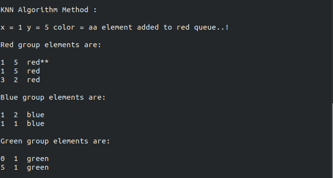
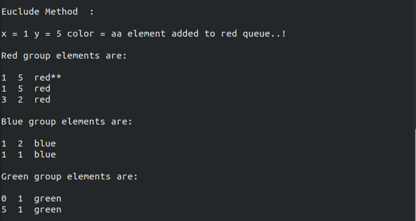

<h1>Sınıflandırma</h1>
<h2>Tanıtım</h2>
<p>
KNN ve Öklid uzaklık algoritmalarını kullanarak  2 boyutlu bir graftaki elemanları
renklerine göre sınıflandırmak ve grafa  eklenen yeni elemanları belirtilen
algoritmaya göre uygun sınıflara atamak.
</p>
<h2> Kod Aşamaları ve açıklama </h2>
<h3>Kütüphaneler ve Namesapce</h3>
```cpp

#include <iostream>
#include <cstdlib>
#include <string.h>
#include <algorithm>
#include <math.h>

using namespace std;

```

<h3> Graftaki eleman yapısı tanımlanır: (x,y) Koordinatları ve Renk</h3>

```cpp

struct Node{
   float xKoordinat;
   float yKoordinat;
   char  renk[10];
   struct Node *next;
};

typedef struct Node node;
typedef node* nodePtr;

```

<h3> Graf Kuyruğu ve Sınıfların  Kuyrukları tanımlanır</h3>

```cpp

nodePtr graphQueue          = NULL;
nodePtr redColorQueue       = NULL;
nodePtr blueColorQueue      = NULL;
nodePtr greenColorQueue     = NULL;

nodePtr ortRedColorQueue    = NULL;
nodePtr ortBlueColorQueue   = NULL;
nodePtr ortGreenColorQueue  = NULL;

```
<h3>Eklenecek elemanın kuyrukların ağırlık merkezinden uzaklık</h3>

```cpp

float distanceFromRedElement   = 0;
float distanceFromBlueElement  = 0;
float distanceFromGreenElement = 0;

```
<h3>Kuyruğun boş olma durumu fonksiyonu</h3>

```cpp

bool isEmpty(nodePtr n){
    return n == NULL;
}

```
<h3>Kuyruğun ortalamasını alan fonksyon (ağırlık merkezi) hesaplanır</h3>

```cpp

void getPartialQueueAverage(nodePtr nod , int index){
    int counter =   0;
    float total1  = 0;
    float total2  = 0;
    nodePtr ptr = nod;

    while (!isEmpty(ptr)) {
       total1 += ptr->xKoordinat;
       total2 += ptr->yKoordinat;
       counter++;
       ptr    = ptr->next;
    }
       nodePtr n = (nodePtr)malloc(sizeof(Node));
       n->xKoordinat = (float)total1/counter;
       n->yKoordinat = (float)total2/counter;
       if(index == 1){
           strcpy(n->renk,"red");
           n->next = ortRedColorQueue;
           ortRedColorQueue=n;
       }
       else if(index == 2){
           strcpy(n->renk,"blue");
           n->next = ortBlueColorQueue;
           ortBlueColorQueue=n;
       }
       else{
           strcpy(n->renk,"green");
           n->next = ortGreenColorQueue;
           ortGreenColorQueue=n;
       }
}

```
<h3> Bütün kuykların ortalaması alınır </h3>

```cpp

void getQueueAverages(){
       getPartialQueueAverage(redColorQueue,1);
       getPartialQueueAverage(blueColorQueue,2);
       getPartialQueueAverage(greenColorQueue,3);
}

```
<h3> Graf  yeni eleman eklemek için insert fonksiyon tanımlanır</h3>

```cpp

void insertNewElementToGraph(int x , int y ,const char *r){
          nodePtr newNode = (nodePtr)malloc(sizeof(Node));
          newNode->xKoordinat = x;
          newNode->yKoordinat = y;
          strcpy(newNode->renk,r);

          newNode->next = graphQueue;
          graphQueue = newNode;

}

```
<h3> Graftaki elemanlar renklerine göre sınıflandırmak makeGroups()</h3>

```cpp
void makeGroups(nodePtr myNode){

        while (!isEmpty(myNode)) {
            if(!strcmp(myNode->renk,"red")){
                  nodePtr newNode     = (nodePtr)malloc(sizeof(Node));
                  newNode->xKoordinat = myNode->xKoordinat;
                  newNode->yKoordinat = myNode->yKoordinat;
                  strcpy(newNode->renk,"red");

                  newNode->next = redColorQueue;
                  redColorQueue = newNode;
             }
            else if(!strcmp(myNode->renk,"blue")){
                nodePtr newNode     = (nodePtr)malloc(sizeof(Node));
                newNode->xKoordinat = myNode->xKoordinat;
                newNode->yKoordinat = myNode->yKoordinat;
                strcpy(newNode->renk,"blue");

                newNode->next = blueColorQueue;
                blueColorQueue = newNode;
             }
            else if(!strcmp(myNode->renk,"green")){
                nodePtr newNode     = (nodePtr)malloc(sizeof(Node));
                newNode->xKoordinat = myNode->xKoordinat;
                newNode->yKoordinat = myNode->yKoordinat;
                strcpy(newNode->renk,"green");

                newNode->next = greenColorQueue;
                greenColorQueue = newNode;
             }
            else{
                cout<<"Eklemek istediğiniz eleman eklenememstir..!"<<endl;
             }
                myNode = myNode->next;
     }
}

```
<h3> Ağırlık merkezinden uzaklık hesaplamak için didstance()</h3>

```cpp

void distance(nodePtr n){
    distanceFromRedElement   = sqrt(pow((ortRedColorQueue->xKoordinat   - n->xKoordinat),2) + pow((ortRedColorQueue->yKoordinat   - n->yKoordinat),2));
    distanceFromBlueElement  = sqrt(pow((ortBlueColorQueue->xKoordinat  - n->xKoordinat),2) + pow((ortBlueColorQueue->yKoordinat  - n->yKoordinat),2));
    distanceFromGreenElement = sqrt(pow((ortGreenColorQueue->xKoordinat - n->xKoordinat),2) + pow((ortGreenColorQueue->yKoordinat - n->yKoordinat),2));
}

```
<h3>Yeni elemana en yakın elemanı bulmak mesafe hesaplama (KNN)</h3>

```cpp

int distanceKNN(nodePtr n1 , nodePtr n2){
    nodePtr ptr = n1;
    int distance , min_distance = 1000;

    while(!isEmpty(ptr)){
         distance =sqrt(pow((ptr->xKoordinat - n2->xKoordinat),2) + pow((ptr->yKoordinat - n2->yKoordinat),2));
         if(distance<min_distance) min_distance = distance;
         ptr = ptr->next;
    }
    return min_distance;
}

```

<h3> Sınıflandırma metoduyla yeni eklenen eleman sınıflandırılır </h3>

```cpp

void byClassificationMethod(int x  , int y ,const char* r){

    nodePtr nod = (nodePtr)malloc(sizeof(Node));
    nod->xKoordinat = x;
    nod->yKoordinat = y;
    distance(nod);

    cout<<endl<<"Classification Method  : "<<endl;

    if(min(distanceFromBlueElement,min(distanceFromGreenElement,distanceFromRedElement))==distanceFromRedElement){
        strcpy(nod->renk,"red**");
        nod->next = redColorQueue;
        redColorQueue = nod;
        cout<<endl<<"x = "<<x<<" y = "<<y<<" color = "<<r<<" element added to red queue..!"<<endl<<endl;
    }
    else if(min(distanceFromBlueElement,min(distanceFromGreenElement,distanceFromRedElement))==distanceFromBlueElement){
        strcpy(nod->renk,"blue**");
        nod->next = blueColorQueue;
        blueColorQueue = nod;
        cout<<endl<<"x = "<<x<<" y = "<<y<<" color = "<<r<<" element added to blue queue..!"<<endl<<endl;
    }
    else{
        strcpy(nod->renk,"green**");
        nod->next = greenColorQueue;
        greenColorQueue = nod;
        cout<<endl<<"x = "<<x<<" y = "<<y<<" color = "<<r<<" element added to green queue..!"<<endl<<endl;
    }
}

```

<h3> KNN algoritmasıyla yeni eklenen eleman sınıflandırılır </h3>

```cpp

void byKnnAlgorithmMethod(int x  , int y ,const char* r){

    nodePtr nod = (nodePtr)malloc(sizeof(Node));
    nod->xKoordinat = x;
    nod->yKoordinat = y;

    int min_distance_redQueue   = distanceKNN(redColorQueue,  nod);
    int min_distance_blueQueue  = distanceKNN(blueColorQueue, nod);
    int min_distance_greenQueue = distanceKNN(greenColorQueue,nod);
    cout<<endl<<"KNN Algorithm Method : "<<endl;
    if(min(min_distance_redQueue,min(min_distance_blueQueue,min_distance_greenQueue))==min_distance_redQueue){
        strcpy(nod->renk,"red**");
        nod->next = redColorQueue;
        redColorQueue = nod;
        cout<<endl<<"x = "<<x<<" y = "<<y<<" color = "<<r<<" element added to red queue..!"<<endl<<endl;
    }
    else if(min(min_distance_redQueue,min(min_distance_blueQueue,min_distance_greenQueue))==min_distance_blueQueue){
        strcpy(nod->renk,"blue**");
        nod->next = blueColorQueue;
        blueColorQueue = nod;
        cout<<endl<<"x = "<<x<<" y = "<<y<<" color = "<<r<<" element added to blue queue..!"<<endl<<endl;
    }
    else{
        strcpy(nod->renk,"green**");
        nod->next = greenColorQueue;
        greenColorQueue = nod;
        cout<<endl<<"x = "<<x<<" y = "<<y<<" color = "<<r<<" element added to green queue..!"<<endl<<endl;
    }
}

```
<h3> Sınıflandırılması gereken eleman eklemek için  </h3>

```cpp

void insertNewElementToBeClassified(int x  , int y ,const char* r , int index){

    if(index == 1){
        byClassificationMethod(x,y,r);
    }
    else if(index == 2){
        byKnnAlgorithmMethod(x,y,r);
    }else{
        cout<<"Please enter a valid index value (1: Classification 2: Knn Algorithm .)"<<endl;
        exit(EXIT_FAILURE);
    }
}

```
<h3> Bütün elemanları gruplarına göre görüntüler </h3>

```cpp

void printElementByGroup(){
   nodePtr ptr1 = redColorQueue;
   nodePtr ptr2 = blueColorQueue;
   nodePtr ptr3 = greenColorQueue;

   if(isEmpty(ptr1)){
       cout<<"No element in Red group..!"<<endl;
   }else{
       cout<<"Red group elements are: "<<endl<<endl;
       while (ptr1 != NULL) {
         cout<<ptr1->xKoordinat<<"  "<<ptr1->yKoordinat<<"  "<<ptr1->renk<<endl;
         ptr1 = ptr1->next;
       }
       cout<<endl;
   }

   if(isEmpty(ptr2)){
       cout<<"No element in Blue group..!"<<endl;
   }else{
       cout<<"Blue group elements are: "<<endl<<endl;
       while (ptr2 != NULL) {
         cout<<ptr2->xKoordinat<<"  "<<ptr2->yKoordinat<<"  "<<ptr2->renk<<endl;
         ptr2 = ptr2->next;
       }
       cout<<endl;
   }

   if(isEmpty(ptr3)){
       cout<<"No element in Green group..!"<<endl;
   }else{
       cout<<"Green group elements are: "<<endl<<endl;
       while (ptr3 != NULL) {
         cout<<ptr3->xKoordinat<<"  "<<ptr3->yKoordinat<<"  "<<ptr3->renk<<endl;
         ptr3 = ptr3->next;
       }
       cout<<endl;
   }
}

```
<h3> Demosu </h3> 

```cpp

int main(){


 insertNewElementToGraph(1,5,"red");         // Graf a elemanlar eklenir
 insertNewElementToGraph(3,2,"red");

 insertNewElementToGraph(1,2,"blue");
 insertNewElementToGraph(1,1,"blue");

 insertNewElementToGraph(0,1,"green");
 insertNewElementToGraph(5,1,"green");

 makeGroups(graphQueue);                        // Elemanlar renklerine göre gruplandırılır
 getQueueAverages();                           //  Grupların koordinatların ortalaması alınır

 insertNewElementToBeClassified(1,5,"aa",1);  //son parametere için   1->Sınıflandırma metodu    2->KNN algoritması metodu


 printElementByGroup();                       // Elemanları gruplarına göre görüntüler

return 0;
}

```

<h2>Örneklerin Çıktıları</h2> 
<ul>
<li> <h3> KNN Algoritması Örneği </h3> </li>

<li> <h3>Öklid Algoritması Örneği</h3> </li>

</ul>

<h3>Kodun Linux tabanlı OS'lerde Çalıştırılması:</h3>

<pre> g++ siniflandirma.cxx -lm && ./a.out </pre>


